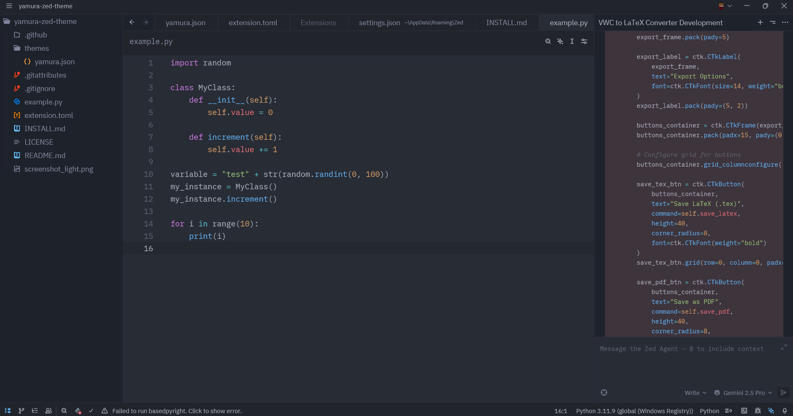

# Yamura for Zed

> A set of beautiful, vibrant themes for the Zed code editor.

The Yamura theme pack provides a comfortable and visually appealing experience for both day and night coding sessions. With a focus on clarity and a vibrant, modern color palette, Yamura aims to make your coding environment both productive and beautiful.

## Themes

This extension includes two primary themes:

-   **Yamura Dark**: A dark theme with a soft, grayish-blue background and vibrant syntax highlighting, perfect for low-light environments.

-   **Yamura Light**: A bright, clean theme with high-contrast syntax highlighting, designed for clarity and readability during the day.

## Installation

1.  Open Zed.
2.  Go to `File` > `Settings` (or press `Ctrl+,`).
3.  Select the `Extensions` tab.
4.  Search for "Yamura" and click `Install`.
5.  Once installed, you can select `Yamura` or `Yamura Light` from the theme selector (`Ctrl+K`, `Ctrl+T`).

### Manual Installation

1.  Download the `themes/yamura.json` file from this repository.
2.  Open your Zed configuration directory.
    -   **macOS & Linux**: `~/.config/zed/`
    -   **Windows**: `%APPDATA%\zed\`
3.  Create a `themes` folder inside the configuration directory if it doesn't already exist.
4.  Copy the `yamura.json` file into the `themes` folder.
5.  The themes will now be available in the theme selector.

## Author

This theme is maintained by Marcelo "Hidemaru" Giratto.

## License

[MIT License](./LICENSE)